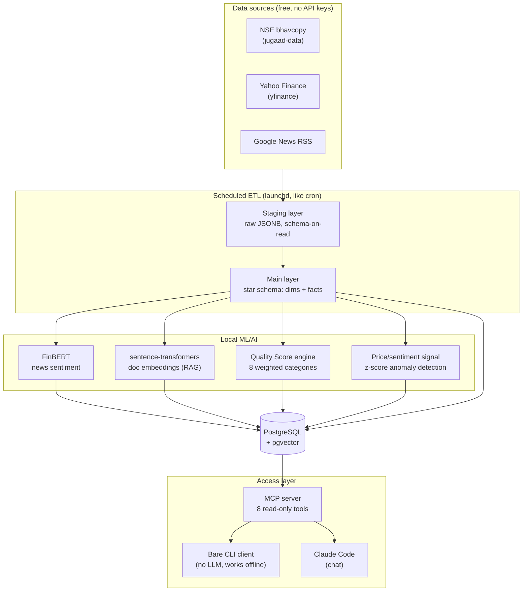

# MyStock — what's actually going on under the hood

A personal Indian stock-market intelligence system: it pulls 10 years of NSE price/volume
history, company fundamentals, and news for ~3,200 listed companies, scores ~750 of them
on an 8-category "quality" rubric, tracks a real equities/ETF portfolio against all of it,
and answers natural-language questions about the whole thing through Claude Code.
Everything runs locally on one Mac — no cloud data warehouse, no paid APIs, no hosted LLM
except the chat interface itself. (Mutual funds are deliberately out of scope — a fund
manager already does the active-management job there.)

Current scale, for context: **3,241 symbols, 4.46M daily price rows spanning 2016–2026,
750 symbols quality-scored, 1,424 news headlines sentiment-scored, 37 live portfolio
holdings.**

## The big picture

## Tech stack

| Layer | Technology | Why |
|---|---|---|
| Database | **PostgreSQL + pgvector** | One database does both relational (star schema) and vector similarity search (embeddings) — no separate vector DB needed. |
| Data ingestion | **jugaad-data**, **yfinance**, **feedparser** (RSS) | All free, no API keys. jugaad-data pulls NSE's own bhavcopy including delivery quantity, which OHLCV-only sources like plain Kaggle dumps don't have. |
| ETL orchestration | Plain Python + **launchd** (macOS's cron equivalent) | No Airflow/Dagster — at this scale (one daily job, a few steps) a workflow engine would be pure overhead. Each step is a Python module, logged to a `metadata.etl_runs` table for observability. |
| Sentiment analysis | **FinBERT** (`ProsusAI/finbert`, via `transformers`) | A BERT model *fine-tuned specifically on financial text* — general-purpose sentiment models misread finance-speak (e.g. "beat estimates" reads as neutral to a generic model but is strongly positive here). Runs locally, free, no per-call cost. |
| Semantic search / RAG | **sentence-transformers** (`all-MiniLM-L6-v2`) + pgvector | Embeds the product docs and schema metadata so an AI can search them by *meaning* ("why is X null") not just keyword match. 384-dim embeddings, cosine similarity via pgvector's `<=>` operator. |
| AI interface | **MCP (Model Context Protocol)** + **Claude Code** | MCP is Anthropic's open standard for connecting AI models to external tools/data — instead of Claude having ad-hoc access to the database, it talks through a defined set of 8 typed, read-only tools. Same protocol any MCP-compatible AI client could use. |
| Scheduling | **launchd** | macOS-native, survives reboots, no extra daemon to install. |

## Key concepts, explained

**Dimensional modeling (star schema).** The "Main" layer isn't just raw tables — it's
`dim_security`, `dim_date`, `dim_sector` (dimensions: the "who/what/when") joined to
`fact_daily_prices`, `fact_volume`, `fact_company_fundamentals` (facts: the numeric
measurements). This is classic data-warehouse design — it's why you can ask "quality
score trend for BAJAJHLDNG over time" as a simple join instead of untangling raw JSON.

**Schema-on-read staging.** Raw API responses land in `staging` as untouched JSONB blobs
first, *then* get cleaned into typed columns. If Yahoo Finance changes its response shape
tomorrow, nothing breaks retroactively — old raw data is still there, only the
cleaning step needs updating.

**The Quality Score.** A custom-built scoring engine, not a copy of any public
methodology: 8 weighted categories (Business Quality, Growth, Financial Strength, Cash
Flow/Capital Allocation, Balance Sheet, Governance, Valuation, Market Behaviour) roll up
~30 sub-metrics into one 0–100 score plus a percentile rank, stored as an
entity-attribute-value (EAV) table so every sub-metric's contribution stays individually
queryable — not just the final number.

**Anomaly detection via z-score.** The "unusual move" signal computes how many standard
deviations today's return is from a stock's trailing 20-day average, then cross-checks
against FinBERT-scored news from the same window — a big move *with* matching bad news is
explained; a big move with no news gets flagged as suspicious (worth a manual look, since
it might just be an unadjusted stock split — a real, documented gap in the pipeline).

**MCP's security model.** All 8 tools connect through a dedicated `mcp_reader` Postgres
role with `SELECT`-only grants — enforced at the database level, not just in application
code. A tool-level keyword filter also rejects any query containing `INSERT`/`DROP`/etc.
as a second layer. Verified this is real, not just documented: connecting directly as
`mcp_reader` and issuing a raw `DELETE` fails with a Postgres permission error, independent
of the application code entirely.

**Store-facts-once (portfolio design).** Current holdings are read from the latest
`OPENING_BALANCE` snapshot, never computed by summing historical buy/sell rows —
summing would double-count if a snapshot was ever taken mid-history. A subtle but
important data-modeling decision that avoids a whole class of "why don't my numbers
match" bugs.

**Fully local AI, except the chat itself.** FinBERT and the embedding model both run on
the Mac's own CPU — no OpenAI/cloud inference calls, no per-request cost, and it all works
completely offline. The one piece that *does* need network access is Claude Code itself
(a hosted model), which is the deliberate design: everything data-related is local and
free; the reasoning/chat layer is the one place a hosted model earns its keep.

## Why this is a decent "what's out there" tour

If your friend is exploring what's currently used in data/AI engineering, this project
touches a lot of ground in one place: **dimensional data warehousing**, **ETL
orchestration**, **local ML inference** (not just calling an API), **vector embeddings +
semantic search**, **the emerging MCP standard for AI-tool integration**, and basic
**production hygiene** (idempotent jobs, data quality checks, role-based access control) —
all without needing a cloud account or a credit card.
